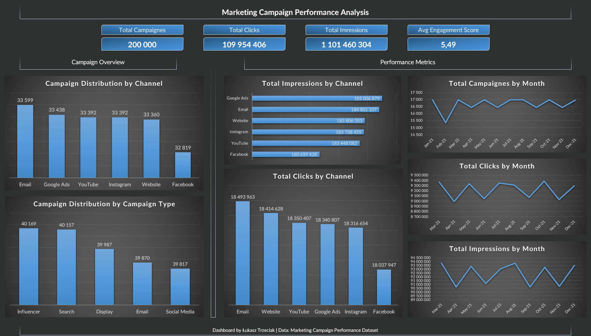

# 📊 Marketing Campaign Performance Analysis

## 🧩 Business Problem

Marketing teams run campaigns across multiple channels and formats, but it’s often unclear how campaign activity and exposure are distributed over time.
The goal of this project is to provide a clear overview of marketing campaign performance using key activity and reach metrics.

This analysis focuses on:
- campaign distribution across channels and campaign types
- campaign activity trends over time
- total clicks and impressions by channel

---

## 📁 Dataset

This project uses the **Marketing Campaign Performance Dataset** from Kaggle.

- **Records:** 200,000
- **Date range:** 2021-01-01 to 2021-12-31

Main fields used in the analysis include:
- `Channel_Used`, `Campaign_Type`
- `Clicks`, `Impressions`
- `Engagement_Score`
- `Conversion_Rate`, `ROI`, `Acquisition_cost`
- `Date`

---

## 🛠 Tools Used

- **MySQL** – SQL querying and analysis  
- **DBeaver** – database management  
- **Microsoft Excel** – dashboard design and visualization  
- **GitHub** – documentation and project publishing  

---

## 📈 Key KPIs (Dashboard)

- **Total Campaigns:** 200,000  
- **Total Clicks:** 109,954,406  
- **Total Impressions:** 1,101,460,304  
- **Avg Engagement Score:** 5.49  

---

## 🔍 Key Findings

- Campaigns are distributed relatively evenly across marketing channels, suggesting a diversified channel strategy.
- Campaign activity remains consistent throughout the year, indicating stable marketing efforts rather than seasonal spikes.
- Channel reach and traffic (impressions and clicks) show only small differences across channels in this dataset.

> Note: Performance metrics such as ROI and conversion rate appear highly consistent across categories, which may indicate a synthetic or normalized dataset.

---

## 📊 Dashboard

The Excel dashboard includes:
- KPI summary (campaigns, clicks, impressions, engagement)
- campaign distribution by channel
- campaign distribution by campaign type
- total clicks by channel
- total impressions by channel
- monthly trends (campaign count, clicks, impressions)

### Dashboard Preview

---

## 📂 Project Structure

marketing-campaign-performance/

│  
├── sql/  
│   └── analysis.sql  
│  
├── excel/  
│   └── marketing_dashboard.xlsx  
│  
├── screenshots/  
│   └── dashboard.png  
│  
└── README.md  

---

## 🎯 Conclusion

This project provides a clear overview of marketing campaign activity and reach across channels and over time.
It can be used as a starting point for deeper performance analysis (e.g., CTR, CPA, ROI by segment) when more variable campaign data is available.
